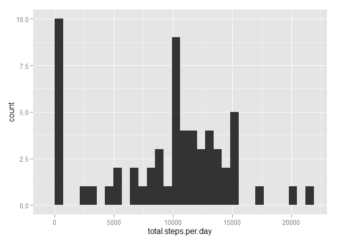
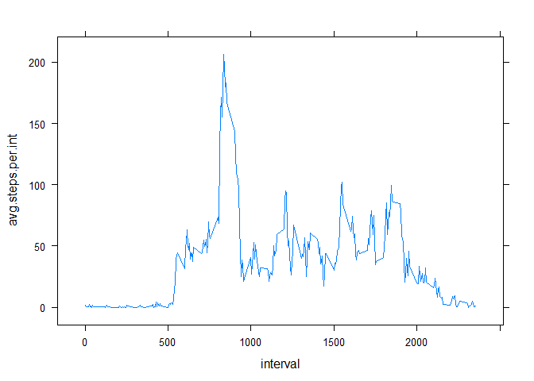
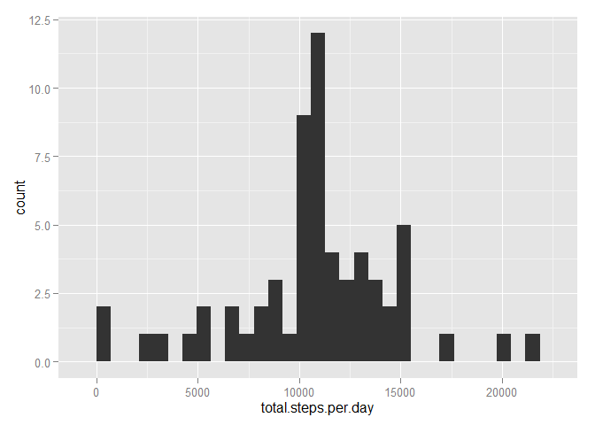
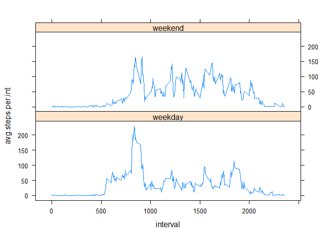

# Reproducible Research - Assignment
    
Reproducible Research - Assignment
========================================================================================

This assignment makes use of data from a personal activity monitoring device. This device collects data at 5 minute intervals through out the day. The data consists of two months of data from an anonymous individual collected during the months of October and November, 2012 and include the number of steps taken in 5 minute intervals each day.


## Data

The data for this assignment can be downloaded from the course web site: 
    
* Dataset: [Activity monitoring data](https://d396qusza40orc.cloudfront.net/repdata%2Fdata%2Factivity.zip) [52K]

The variables included in this dataset are:
* **steps**: Number of steps taking in a 5-minute interval (missing values are coded as `NA`)

* **date**: The date on which the measurement was taken in YYYY-MM-DD format

* **interval**: Identifier for the 5-minute interval in which measurement was taken


### Loading and preprocessing the data

Show any code that is needed to

1. Load the data (i.e. `read.csv()`)

```r
data <- read.csv('activity.csv', header=TRUE, sep=",", quote="\"", colClasses = c('integer', 'character', 'integer'))
```

2. Process/transform the data (if necessary) into a format suitable for your analysis

```r
data$date <- as.Date(data$date, "%Y-%m-%d")
```

### What is mean total number of steps taken per day?

For this part of the assignment, you can ignore the missing values in the dataset.

1. Make a histogram of the total number of steps taken each day

```r
library(dplyr)
```

```
## Warning: package 'dplyr' was built under R version 3.0.3
```

```
## 
## Attaching package: 'dplyr'
## 
## The following objects are masked from 'package:stats':
## 
##     filter, lag
## 
## The following objects are masked from 'package:base':
## 
##     intersect, setdiff, setequal, union
```

```r
hist.data <- data %>% group_by(date) %>% summarise(total.steps.per.day = sum(steps, na.rm=TRUE))
```


```r
library(ggplot2)
```

```
## Warning: package 'ggplot2' was built under R version 3.0.3
```

```r
ggplot(hist.data, aes(x=total.steps.per.day)) + geom_histogram()
```

```
## stat_bin: binwidth defaulted to range/30. Use 'binwidth = x' to adjust this.
```

 

2. Calculate and report the **mean** and **median** total number of steps taken per day

```r
paste('Mean total number of steps taken per day:', mean(hist.data$total.steps.per.day))
```

```
## [1] "Mean total number of steps taken per day: 9354.22950819672"
```

```r
paste('Median total number of steps taken per day:', median(hist.data$total.steps.per.day))
```

```
## [1] "Median total number of steps taken per day: 10395"
```

### What is the average daily activity pattern?

1. Make a time series plot (i.e. `type = "l"`) of the 5-minute interval (x-axis) and the average number of steps taken, averaged across all days (y-axis)

```r
time.data <- data %>% group_by(interval) %>% summarise(avg.steps.per.int = mean(steps, na.rm=TRUE))
```


```r
library(lattice) 
xyplot(avg.steps.per.int ~ interval, data = time.data, type='l')
```

 

2. Which 5-minute interval, on average across all the days in the dataset, contains the maximum number of steps?

```r
paste('Interval: ', time.data[time.data$avg.steps.per.int == max(time.data$avg.steps.per.int), 1])
```

```
## [1] "Interval:  835"
```

### Imputing missing values

Note that there are a number of days/intervals where there are missing
values (coded as `NA`). The presence of missing days may introduce
bias into some calculations or summaries of the data.

1. Calculate and report the total number of missing values in the dataset (i.e. the total number of rows with `NA`s)

```r
sum(is.na(data$steps))
```

```
## [1] 2304
```

2. Devise a strategy for filling in all of the missing values in the dataset. The strategy does not need to be sophisticated. For example, you could use the mean/median for that day, or the mean for that 5-minute interval, etc.

```r
data.and.time.data <- inner_join(data, time.data, by='interval')
```

3. Create a new dataset that is equal to the original dataset but with the missing data filled in.

```r
data[is.na(data$steps), 1] <- data.and.time.data[is.na(data$steps), 4]

filled.na.data <- data
rm(data, data.and.time.data, hist.data, time.data)
```

4. Make a histogram of the total number of steps taken each day and Calculate and report the **mean** and **median** total number of steps taken per day. Do these values differ from the estimates from the first part of the assignment? What is the impact of imputing missing data on the estimates of the total daily number of steps?

```r
hist.data <- filled.na.data %>% group_by(date) %>% summarise(total.steps.per.day = sum(steps, na.rm=TRUE))

ggplot(hist.data, aes(x=total.steps.per.day)) + geom_histogram()
```

```
## stat_bin: binwidth defaulted to range/30. Use 'binwidth = x' to adjust this.
```

 

```r
paste('Mean total number of steps taken per day:', mean(hist.data$total.steps.per.day))
```

```
## [1] "Mean total number of steps taken per day: 10766.1886792453"
```

```r
paste('Median total number of steps taken per day:', median(hist.data$total.steps.per.day))
```

```
## [1] "Median total number of steps taken per day: 10766.1886792453"
```


### Are there differences in activity patterns between weekdays and weekends?

For this part the `weekdays()` function may be of some help here. Use
the dataset with the filled-in missing values for this part.

1. Create a new factor variable in the dataset with two levels -- "weekday" and "weekend" indicating whether a given date is a weekday or weekend day.

```r
Sys.setlocale("LC_ALL","English")

week <- ifelse(weekdays(filled.na.data$date, abbreviate = TRUE) == 'Sun', 1, 0) + ifelse(weekdays(filled.na.data$date, abbreviate = TRUE) == 'Sat', 1, 0)

filled.na.data$week <- ifelse(week == 1, 'weekend', 'weekday')
```

1. Make a panel plot containing a time series plot (i.e. `type = "l"`) of the 5-minute interval (x-axis) and the average number of steps taken, averaged across all weekday days or weekend days (y-axis). The plot should look something like the following, which was created using **simulated data**:


```r
time.data <- filled.na.data %>% group_by(interval, week) %>% summarise(avg.steps.per.int = mean(steps, na.rm=TRUE))

xyplot(avg.steps.per.int ~ interval | week, data = time.data, layout = c(1, 2), type='l')
```

 


